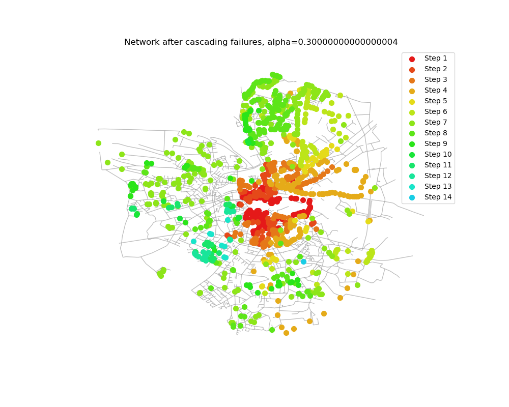
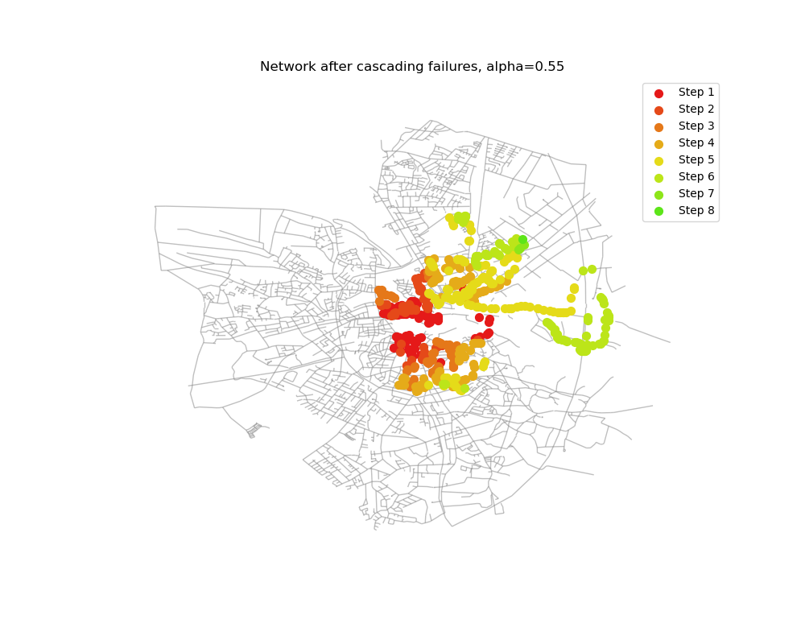

#  Cascading Failure in Network

## 1. 阅读本周参考资料。

### 研究思路和目标

这篇论文的研究思路是理解和揭示在复杂网络中，尤其是如互联网和电力网这样的重要基础设施网络中，级联失效是如何发生的。目标是通过分析网络对随机故障和蓄意攻击的反应，揭示网络结构和节点负载分布对网络稳定性的影响。进一步，研究旨在探讨如何通过改进网络设计，增强网络的鲁棒性，减少因关键节点失败而引发的连锁反应的可能性。这项研究不仅增进了我们对复杂网络行为的理解，也为设计更安全、更稳定的网络系统提供了理论依据。

### 研究方法

本文采用的研究方法是构建模型并进行模拟实验。作者通过定义网络中节点的负载以及节点的容量，来模拟在节点移除后负载重新分配的过程。这一过程中，如果任一节点的负载超过其容量，该节点将会失效，可能引发级联反应，导致更多节点相继失败。这种方法允许研究者在控制条件下观察和分析复杂网络在面对随机故障和蓄意攻击时的反应。

### 研究步骤

研究步骤可以分为三个阶段：首先，基于真实世界网络的特性，建立了一个关于网络节点负载和容量的模型。然后，通过模拟不同情境下（随机故障和蓄意攻击）的节点移除，观察网络的反应，特别是级联失效的发生和扩散。接下来，通过对比均匀网络和无标度网络的模拟结果，分析网络的脆弱性。最后，通过量化分析，识别出导致大规模级联反应的关键因素，如网络的异质性和关键节点。


## 2. 从 https://users.cs.utah.edu/~lifeifei/SpatialDataset.htm 上下载City of Oldenburg (OL) Road Network数据集，其包括了路网节点的坐标和边权，因此，能够在二维平面上可视化（具体使用nx.draw_networkx_nodes(G, pos, node_size=300, node_color='r', node_shape='o')，其中，pos实际上就是一个字典，其中键为节点，值为坐标x和y）该网络。利用该数据集，参照1中的文献，完成如下任务：

### 问题重述

(1). 实现Motter模型，堵塞网络的空间中心区域（根据平面坐标计算）少量节点，观察不同$\alpha$下，网络最大连通分量的变化，并讨论是否存在$\alpha_c$（如级联次数最多的$\alpha$）。


(2). 尝试讨论不同$\alpha$时（尤其是$\alpha_c$附近时），最大连通分量和第二大连通分量随$t$的变化形态。


(3). 可视化级联失效（在某个$\alpha$时，如$\alpha_c$），用不同的颜色表示初始失效的节点，当步失效的节点，已经失效的节点等，观察传播是否在空间上存在某种模式。

### 实现代码

对于以上问题讨论分析，基于下方代码实现：

```python

import colorsys
import networkx as nx
import matplotlib.pyplot as plt
import numpy as np
import os

def load_network(nodes_file, edges_file):
    G = nx.Graph()
    pos = {}
    with open(nodes_file, 'r') as nf:
        for line in nf:
            node_id, x, y = line.strip().split()
            G.add_node(int(node_id))
            pos[int(node_id)] = (float(x), float(y))
    
    with open(edges_file, 'r') as ef:
        for line in ef:
            _, start_node_id, end_node_id, _ = line.strip().split()
            G.add_edge(int(start_node_id), int(end_node_id))
    
    return G, pos

def block_center_nodes(G, pos):
    center_x = np.mean([pos[node][0] for node in G])
    center_y = np.mean([pos[node][1] for node in G])

    distances = {node: np.sqrt((x - center_x) ** 2 + (y - center_y) ** 2) for node, (x, y) in pos.items()}

    nodes_to_block_count = int(len(G) * 0.01) 
    nodes_sorted_by_distance = sorted(distances, key=distances.get)[:nodes_to_block_count]

    G.remove_nodes_from(nodes_sorted_by_distance)
    return nodes_sorted_by_distance

def generate_hsl_colors(n):
    colors = []
    step = 360 / n
    
    saturation = 80  
    lightness = 50   
    
    for i in range(n):
        hue = int(step * i)
        colors.append(f"hsl({hue}, {saturation}%, {lightness}%)")
    return colors

def hsl_to_rgb_corrected(hsl_colors):
    rgb_colors_corrected = []
    for hsl in hsl_colors:
        h, s, l = hsl[4:-1].split(', ')
        h = int(h)
        s = float(s.strip('%')) / 100
        l = float(l.strip('%')) / 100
        rgb = colorsys.hls_to_rgb(h/360, l, s)
        rgb_hex = f"#{int(rgb[0]*255):02x}{int(rgb[1]*255):02x}{int(rgb[2]*255):02x}"
        rgb_colors_corrected.append(rgb_hex)
    return rgb_colors_corrected


def visualize_network(G, pos, alpha, step, overloaded_nodes_by_step):
    plt.figure(figsize=(10, 8))
    nx.draw_networkx_edges(G, pos, alpha=0.5, edge_color='gray')
    colors = hsl_to_rgb_corrected(generate_hsl_colors(25))
    for i, nodes in enumerate(overloaded_nodes_by_step):
        nx.draw_networkx_nodes(G, pos, nodelist=nodes, node_size=50, 
                               node_color=colors[i % len(colors)], label=f'Step {i+1}')
    plt.title(f"Network after cascading failures, alpha={alpha}")
    plt.legend()
    plt.axis('off')
    plt.savefig(f'./Images/network_alpha_{alpha:.2f}_step_{step}.png')
    plt.close()

def simulate_cascade(G, pos, alpha):
    initial_load = nx.betweenness_centrality(G)
    block_center_nodes(G, pos)
    capacity = {node: load * (1 + alpha) for node, load in initial_load.items()}
    overload = True
    step = 0
    sizes = []
    overloaded_nodes_by_step = []
    while overload:
        step += 1
        load = nx.betweenness_centrality(G)
        overloaded_nodes = [node for node, l in load.items() if l > capacity[node]]
        overloaded_nodes_by_step.append(overloaded_nodes)
        G.remove_nodes_from(overloaded_nodes)
        overload = len(overloaded_nodes) > 0
        sizes.append((len(max(nx.connected_components(G), key=len)) / len(pos), 
                      len(sorted(nx.connected_components(G), key=len, reverse=True)[1]) / len(pos) if len(G) > 1 else 0))
    visualize_network(G, pos, alpha, step, overloaded_nodes_by_step)
    return step, sizes

def plot_cascades_vs_alpha(alpha_values, cascade_counts):
    plt.figure(figsize=(8, 6))
    plt.plot(alpha_values, cascade_counts, '-o', color='b')
    plt.xlabel('Alpha')
    plt.ylabel('Number of Cascading Rounds')
    plt.title('Cascading Rounds vs Alpha')
    plt.grid(True)
    plt.savefig('./Images/cascades_vs_alpha.png')
    plt.close()

def plot_cc_ratios_vs_cascades(alpha_values, cc_ratios):
    plt.figure(figsize=(14, 7))
    for i, alpha in enumerate(alpha_values):
        sizes = cc_ratios[i]
        cascades = range(1, len(sizes) + 1)
        largest_cc_ratios = [size[0] for size in sizes]
        second_largest_cc_ratios = [size[1] for size in sizes]
        
        plt.subplot(1, 2, 1)
        plt.plot(cascades, largest_cc_ratios, label=f'Alpha={alpha:.1f}')
        plt.xlabel('Cascades')
        plt.ylabel('Largest CC Size Ratio')
        plt.title('Largest CC Size Ratios vs Cascades')
        
        plt.subplot(1, 2, 2)
        plt.plot(cascades, second_largest_cc_ratios, label=f'Alpha={alpha:.1f}')
        plt.xlabel('Cascades')
        plt.ylabel('Second Largest CC Size Ratio')
        plt.title('Second Largest CC Size Ratios vs Cascades')

    plt.subplot(1, 2, 1)
    plt.legend(loc='upper left')
    plt.subplot(1, 2, 2)
    plt.legend(loc='upper left')
    plt.tight_layout()
    plt.savefig('./Images/cc_ratios_vs_cascades.png')
    plt.close()

if __name__ == '__main__':
    nodes_file = './Data/Nodes.txt'
    edges_file = './Data/Edges.txt'
    G, pos = load_network(nodes_file, edges_file)
    alpha_values = np.arange(0,1.2,0.05)
    cascade_counts = []
    cc_ratios = []

    if not os.path.exists('./Images'):
        os.makedirs('./Images')

    for alpha in alpha_values:
        G_copy = G.copy()
        step_count, sizes = simulate_cascade(G_copy, pos, alpha)
        cascade_counts.append(step_count)
        cc_ratios.append(sizes)
    
    plot_cascades_vs_alpha(alpha_values, cascade_counts)
    plot_cc_ratios_vs_cascades(alpha_values, cc_ratios)

```

### 结果

代码运行结果如下：

a.级联次数随$\alpha$变化折线图


由图像分析可知，最大级联次数的$\alpha_c$应该位于0.3-0.4之间，本文近似认为最大级联次数对应的$\alpha$为0.35.

b.不同$\alpha$下，最大联通分量和第二大联通分量占比随级联次数的变化


c.不同$\alpha$下，具体可视化级联扩撒轮次图








### 分析与讨论

根据以上运行代码进行分析，可以得到以下三点结论：

a. 级联次数随$\alpha$呈两段攀升式变化。具体体现为，随着容忍系数$\alpha$的不断增加，级联次数先增长，后降低，但是在维持一段稳定后再次升高。这种现象的出现，可以从网络的鲁棒性和脆弱性两个角度来理解。在$\alpha$较低时，网络的鲁棒性较弱，节点因为容忍能力低而容易发生级联失效。这是因为$\alpha$低意味着节点能够承受的额外负载有限，一旦节点或连接遭到移除，其余节点迅速达到或超过负载容量，从而引发连锁反应。随着$\alpha$的增加，节点的容忍能力增强，网络能够承受更多的初始冲击而不发生大规模的崩溃，导致需要更多的轮次来完成级联过程。但是，当$\alpha$增加到一定程度，网络中的部分节点成为了瓶颈，这些节点一旦失效，会迅速引发大规模的网络崩溃，因此级联次数再次上升。

b.不同$\alpha$下，最大连通分量占比呈现两段“滑坡”式衰减，第二大连通分量占比呈现两段式攀升。以$\alpha = 0.35$为例，在前7次级联中，最大连通分量衰减速度不断降低直至趋于平稳，但是在第8次又迅速降低，然后衰减速度趋于平稳。第二大连通分量占比从另一个角度反映了这个现象，$\alpha = 0.35 $时，第二大连通分量占比“攀升——水平——攀升——水平”的状态。具体原因分析：最大连通分量占比的“滑坡”式衰减和第二大连通分量占比的“两段式”攀升，反映了网络在经历初始冲击后逐步分裂成较小的连通分量的过程。$\alpha$较低时，网络较为脆弱，一个小的冲击即可导致大规模的网络分裂，因此最大连通分量快速减少。随着$ \alpha $的增加，网络的整体承压能力增强，导致在一定的级联次数内，最大连通分量占比的衰减速度变缓，反映了网络在抵抗级联失效方面的韧性提升。然而，当网络中的关键节点因负载过高而失效时，网络的连通性会迅速下降，导致最大连通分量的占比再次快速衰减。

c.对于具体的扩散过程进行可视化结果观察发现，呈现“中心空缺 - 外围扩散 - 内部收缩”的级联失效模式。以$\alpha = 0.35$为例，初始空缺中心节点后，级联失效轮次不断扩散，但是当外围节点失效后，可以发现级联失效开始向内部收缩（深蓝色节点）。对于原因进行分析，这一模式的出现，与网络的拓扑结构密切相关。在无标度网络，中心节点（即度较高的节点）对网络的连通性起着至关重要的作用。移除这些中心节点会导致网络的快速分裂和功能衰减。随后，失效扩散到网络的外围，因为这些区域的节点度通常较低，抗压能力弱。但是，随着外围节点的失效，级联效应开始向网络的内部区域收缩，因为网络的内部节点成为连接各个分裂部分的关键路径。这种从外围到内部的失效传播，最终导致网络分裂成若干孤立的连通分量，网络的整体功能大大降低。


## 3. 思考级联失效在社会网络中，特别是信息传播过程的潜在应用。比如，信息扩散时，部分用户可能因为收到的信息过载而不再参与后续信息的扩散，这样是否能够描述在信息过载情形下的扩散不畅现象？（引题仅讨论）

在今天这个信息爆炸的时代，信息过载是一个普遍存在的现象，不仅影响个体的信息处理能力，还可能影响整个社会网络中信息的传播效率和范围。在社会网络中，信息过载可被视为一种“节点过载”。当用户（即网络中的节点）接收到的信息量超过其处理或者吸收的能力时，他们可能选择不再进一步传播信息，即节点失效。这与复杂网络中因负载过大而导致的节点失效相似，可以通过级联失效模型进行模拟和分析。一旦足够多的节点因信息过载而“失效”，即停止传播信息，信息的进一步扩散就会受阻，导致整个网络的传播效率下降。

以社交媒体上的热点事件传播为例：在事件的初期，信息可能迅速通过网络中的高度连接节点（如具有大量关注者的社交媒体影响者）进行传播。然而，随着信息量的增加，普通用户可能开始感到信息过载，尤其是当相似或重复的内容不断出现时。这时，即使他们接收到了信息，也可能选择不参与进一步的传播，导致信息扩散速度减缓，甚至在某些区域停止扩散。这种现象在社交网络上经常可见，尤其是在大型事件或广泛讨论的话题中。为了避免信息过载，信息发布者可以考虑采取优化信息质量、目标化传播、调整发布频率等，以在一定程度上减缓或避免因信息过载导致的传播不畅现象，提高信息在社会网络中的传播效率和影响力。